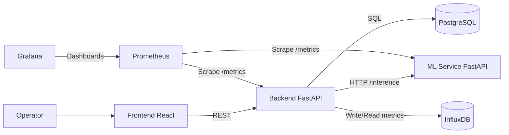
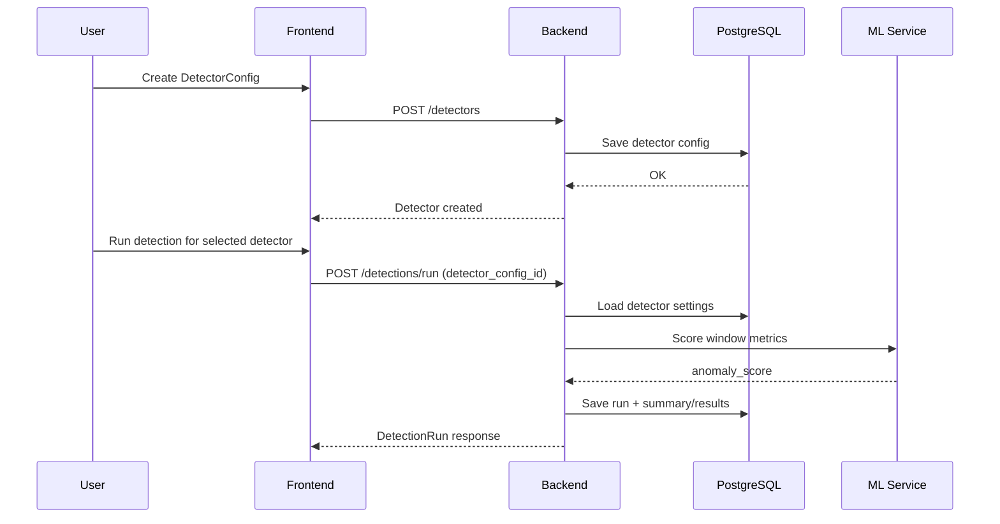
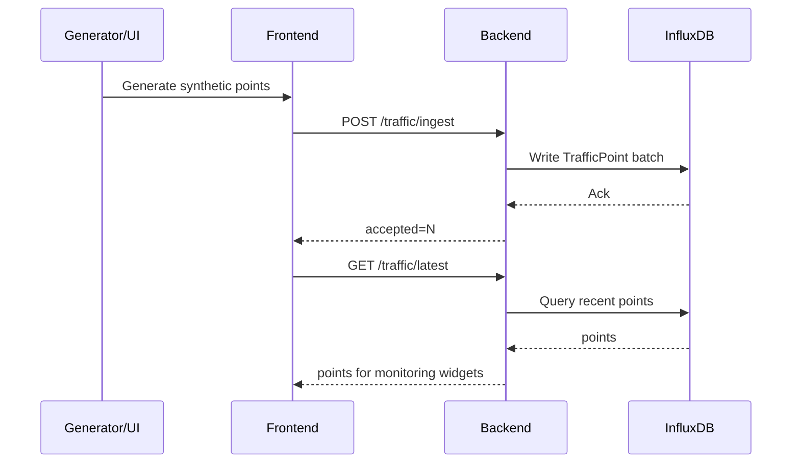

# DevOps

Репозиторий для лабораторных по дисциплине DevOps.

## ЛР1: Отчёт
- Подробное описание системы и соответствие пунктам задания:  
  [`docs/lab1-report.md`](docs/lab1-report.md)

## Services
- `backend/` - FastAPI REST API for detector profiles, traffic ingest, monitoring, detections, generator jobs
- `frontend/` - React web client (react-scripts runtime, no Vite)
- `ml-service/` - FastAPI ML inference service using packaged scaler/model artifacts from `ml-service/models/v0/`
- `prometheus/` - scrape configuration for backend and ML service runtime metrics
- `grafana/` - provisioned datasource and dashboard for local observability
- `postgres` - durable operational store for detector/detection/generator domain
- `influxdb` - time-series store for traffic points

## Architecture

## Flow 1: Detector Lifecycle + Detection Run

Detection results shown in the Detections tab include the model anomaly score when it is present in
the run summary payload.
During detection runs, the backend prepares the full model-compatible metric set for `ml-service`;
when source traffic metrics are partial, derived values and safe defaults are used without changing
the run summary contract exposed to operators.

## Flow 2: Traffic Ingest + Monitoring

## Quick Start
1. Build and start stack:
   - `docker compose up -d --build`
2. Open frontend:
   - `http://localhost:3000`
3. API docs:
   - `http://localhost:8000/docs`
4. Observability:
   - Prometheus: `http://localhost:9090`
   - Grafana: `http://localhost:3001` (`admin` / `adminadmin`)

## Observability
- Backend metrics endpoint: `http://localhost:8000/metrics`
- ML service metrics endpoint: `http://localhost:8001/metrics`
- Prometheus scrapes both services using `prometheus/prometheus.yml`
- Grafana auto-provisions the Prometheus datasource and the `Traffic Anomaly Platform` dashboard

Detailed feature validation steps:
- `specs/001-rework-detector-workflow/quickstart.md`

## Local Validation
1. Frontend unit tests + build:
   - `cd frontend && npm run typecheck && npm test && npm run build`
2. Backend tests:
   - `PYTHONPATH=. .venv/bin/python -m pytest -q backend/tests`
3. ML service tests:
   - `PYTHONPATH=ml-service .venv/bin/python -m pytest -q ml-service/tests`

## Engineering Governance
Проектные правила разработки и качества закреплены в
`.specify/memory/constitution.md`.
